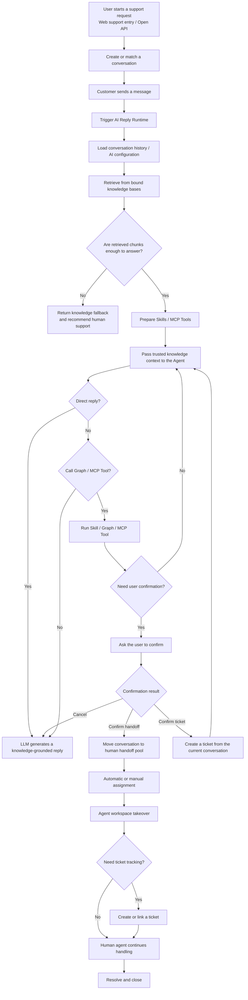
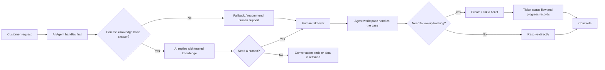

# AgentDesk

English | [简体中文](README_ZH.md)

An open-source AI Agent customer support system with knowledge-based answers, human handoff, ticket workflows, and self-hosted deployment.

> Built for teams that need online support, knowledge-base Q&A, human collaboration, and service tracking in one system. It is not just an LLM inside a chat box; it is an AI Helpdesk foundation designed around real support operations.

## What's New

Everything below is additive; the sections that follow this one are unchanged.

### Russian localization

`ru-RU` is now a fully supported third locale, on both sides of the wire.

- Backend: `internal/pkg/i18nx/locales/ru-RU.yml`, complete alongside `zh-CN` and `en-US`, so every user-visible backend error is translated in all three.
- Frontend: `web/messages/ru-RU.json`, a full catalogue rather than a partial one.
- Permission and role display names are localized per locale instead of falling back to the backend's Chinese labels.
- The UI font moved from Geist to Inter, which has real Cyrillic coverage. The previous font rendered Russian with mismatched glyphs.
- Missing copy was filled in for the support portal, community, audit and help pages, admin settings, and navigation; several places were rendering raw message keys instead of text.
- `web/i18n/message-integrity.test.mjs` now fails the build when a key used in the UI is missing from any locale, so a gap cannot come back silently.
- A single radius scale was applied across dashboard and support surfaces.

To change the default locale, set `language` in `config/config.yaml`. `zh-CN`, `en-US` and `ru-RU` are supported.

### Visitor identity from a host platform

A host that embeds the widget can now assert the identity of its own signed-in user, so the visitor is treated as identified rather than anonymous. There are two paths, and both already existed conceptually:

- `userToken`: a JWT issued by the host, verified against a per-channel secret.
- `externalId`: a new signed identity, verified against a deployment-wide shared secret.

```
signature = hex(HMAC-SHA256(secret, channelId + "\n" + externalId + "\n" + issuedAt))
```

`issuedAt` is unix seconds, sent alongside the signature as `externalIdSignedAt` (`X-External-Id-Signed-At`), and is covered by the signed bytes. Two properties are deliberate:

- The channel ID is part of the payload, because visitor identities are stored globally: a signature minted for one channel must not assert the same identity on another.
- The timestamp is inside the signed payload even though it also travels as its own field, so a captured signature cannot be re-dated.

A signature is accepted only while it is within `identity.maxAgeMinutes` (default 24 hours). This bounds how long a leaked signature stays replayable. It does not protect the secret: HMAC is not invertible, so an external ID and its signature reveal nothing about the key, and no expiry would change that.

Anything that is missing, forged, expired or replayed against a different visitor is downgraded to an anonymous guest rather than rejected, so an unsigned embed keeps working exactly as before.

New configuration:

```yaml
identity:
  secret: ""            # IDENTITY_HMAC_SECRET — empty disables signed identities
  maxAgeMinutes: 1440   # IDENTITY_SIGNATURE_MAX_AGE_MINUTES
```

The SDK resolves a fresh signature on every `open()` and reloads the frame when the resolved URL changes. Without that, a host page left open longer than the max age would silently degrade to a guest. It also fixes the same staleness for `userToken`, which had been frozen at the first `open()`.

### Several requests per visitor

A visitor could previously only ever hold one conversation: creating one resumed the most recent unfinished request, so a second, unrelated issue silently landed in the first thread.

- `POST /api/conversation/create` starts a new request and never resumes.
- `POST /api/conversation/create_or_match` is unchanged, because reloading the page must still rejoin the live thread rather than orphan it.
- `GET /api/conversation/list` returns the visitor's own requests, scoped from the external identity the request already carries.
- Conversations carry an optional `subject`, so several requests are tellable apart.
- `conversation.customerMaxOpen` caps how many requests may be open at once (default 3, `-1` removes the cap). The cap protects agents rather than the visitor: each open request is real work, and in human-only mode creating one dispatches an agent immediately. It applies only to the create path, never to the resume path.

The widget gained a request switcher showing the current subject, total unread, and per-request status and time. Activity in a request you are not viewing now surfaces in the switcher instead of being discarded.

### Support portal

- `/` redirects to `/support`, so the visitor-facing entry point is what loads first.
- `/support/chat` opened directly now renders a real page shell instead of a bare widget; embedded in an iframe it still behaves as a widget.
- Enterprise SSO (OIDC, WeCom) is no longer offered to portal visitors, and the server rejects it for a portal destination. Those transports create a staff account with a staff role and never link it to a customer, so a visitor signing in through the portal would have received an employee session with none of their history behind it.
- `/dashboard/users` filters on account type and shows a type column. Portal visitors previously appeared in the agent list with admin actions offered on them.

### Email channel

The email channel works as a full request medium: a visitor's mail becomes a conversation, and the conversation continues as mail.

- **Inbound from real mail.** `POST /api/third/email/webhook` accepts Cloudflare Email Routing, Mailgun, SendGrid, Brevo, Postmark and generic JSON. A Cloudflare worker that parses MIME and forwards is included in `scripts/cloudflare-email-worker`.
- **Inbound from a program.** `POST /api/third/email/request` files a request from an external system. This is the API bridge for headless integrations - it is the only way to open a request without a browser or a mail forwarder:

  ```bash
  curl -X POST https://your-desk.example.com/api/third/email/request/support_mail \
    -H 'Content-Type: application/json' \
    -H 'X-Webhook-Secret: <channel webhook secret>' \
    -d '{"email":"alice@example.com","name":"Alice","subject":"Cannot complete payment","message":"The checkout page spins forever."}'
  ```

  It answers with the conversation id, the subject, and where the request actually landed:

  ```json
  { "conversationId": 42, "outcome": "email", "verified": true, "subject": "Cannot complete payment" }
  ```

  **Verified and self-reported modes.** Presenting the channel's `X-Webhook-Secret` marks the submitted address as verified. Omitting it still files the request, but the address is recorded as self-reported and agents can see that in the dashboard, so an unproven address is never mistaken for a proven one. A secret that is present but wrong is rejected rather than quietly downgraded - a broken integration must not look like a working one.
- **Automatic acknowledgement.** The visitor gets a receipt by email as soon as the request is filed, then the AI Agent's answer arrives separately. The receipt text comes from the channel's welcome message, so it can be branded per channel.
- **Where a request lands.** If the visitor still has a live chat open, the email is appended to that chat instead of starting an email thread - they are present in the chat and absent from their inbox - and they are emailed a note asking them to continue there. Once the chat has gone quiet it counts as abandoned and the email becomes its own conversation. The window is `conversation.emailChatLiveMinutes`, 30 minutes by default.
- **Replies.** `Reply-To` points at the channel's own inbound address, so a reply comes back to AgentDesk rather than to the agent's mailbox. Threads hold through the `[#id]` token in the subject and through `In-Reply-To`.
- **Outbound delivery** goes through an outbox with retries, over SMTP, Brevo, SendGrid, Resend, Postmark or Mailgun.

```yaml
email:
  provider: smtp        # smtp | brevo | sendgrid | resend | postmark | mailgun
  fromAddress: support@example.com
  fromName: Support
  smtpHost: smtp.example.com
  smtpPort: 587
  smtpUser: support@example.com
  smtpPassword: ...
  smtpUseTls: true
  inboundSecret: ...    # fallback when a channel has no secret of its own
```

### Fixes

- The email channel wrote to an outbox `send_detail` column that no migration created, so outbound email failed on an unpatched database.
- Sidebar section titles wrapped inside a fixed-height row and overlapped their neighbours. A section trigger is the one place where the label is not the button's last child, so the shared truncation never reached it.
- Regenerated the shared frontend enums, which were missing four `ExternalSource` values and the whole `UserType` enum.

## Product Preview

Customer chat, agent workspace, knowledge base, model configuration, and AI Agent orchestration are managed in one system.

### Customer Chat


Customers can start a conversation from the web chat page. The AI Agent responds first with knowledge-grounded answers. When the user explicitly asks for a human, the system can start a handoff confirmation flow.

### Agent Workspace


The support workspace includes conversation lists, message handling, AI-to-human handoff, agent replies, conversation tags, linked customers, and ticket context for daily support work.

### Knowledge Base and AI Agent Configuration

| Knowledge Base FAQ | AI Agent Configuration |
| --- | --- |
|  |  |

The knowledge base stores FAQs, documents, and retrievable content. AI Agents can be bound to model configurations, knowledge bases, Skills, and tools to create support agents for specific scenarios.

### Model Configuration


Model configuration supports OpenAI-compatible providers. You can configure LLMs, embedding models, rerank models, context limits, output settings, timeout, retry behavior, and enablement state.

## Why Use It

- **AI-first support**: Let AI Agents handle common questions, standard procedures, and knowledge-base answers first.
- **Knowledge-constrained replies**: Use RAG and the Answerability Gate to decide whether retrieved knowledge is strong enough to answer, reducing unsupported responses.
- **Natural human handoff**: Move to human agents when knowledge is insufficient, the user asks for help, or a workflow requires human confirmation.
- **Conversation-to-ticket loop**: Online chat, support handling, ticket creation, status flow, and progress records stay in one system.
- **Built for extension**: The backend uses Go, the frontend uses Next.js, and the runtime supports Skills, MCP, and OpenAI-compatible model access.
- **Self-host friendly**: Supports SQLite / MySQL and Qdrant for local trials, intranet deployment, and enterprise self-hosting.

## Core Capabilities

- **AI Agent support**: AI replies first, with fallback, confirmation, tool calling, and human collaboration.
- **Online conversation system**: Visitor sessions, message send/receive, unread status, assignment, transfer, and close flows.
- **Agent workspace**: Agents can take over conversations, reply to users, transfer teammates, link customers, and create tickets.
- **Knowledge-base RAG**: Knowledge bases, documents, FAQs, chunking, vector retrieval, retrieval logs, and quality analysis.
- **Answerability Gate**: Checks whether retrieved content can support an answer; otherwise returns a fallback and recommends human support.
- **Ticket system**: Create tickets from conversations, categorize, assign, move through status flows, record progress, and close the loop.
- **Support organization management**: Agent profiles, teams, schedules, and automatic assignment.
- **AI extensibility**: Skills, MCP debugging, and external tool integration.
- **Multiple entry points**: Admin dashboard, agent workspace, customer-facing web pages, and embeddable SDK.

## Use Cases

- Website live support
- SaaS product support
- AI + human hybrid support
- Internal enterprise service desk
- After-sales service, incident reporting, complaints, and operations support
- Support teams that need knowledge-base Q&A with human collaboration

## Quick Start

The fastest way to try the full stack is Docker Compose:

```bash
docker compose up -d --build
```

For the full English setup guide, see [Docker Compose Quick Start](https://agent-desk.huabei.pro/docs/getting-started/docker-compose.html).

To embed customer support on your website, see [Web Widget Integration](https://agent-desk.huabei.pro/docs/integration/web-widget.html).

To connect OpenAI-compatible model providers, see [Model Provider Configuration](https://agent-desk.huabei.pro/docs/config/model-provider.html).

Compose starts:

- `agent-desk`: application service on port `8083`
- `mysql`: MySQL 8.4 with the `mysql-data` volume
- `qdrant`: vector database with the `qdrant-data` volume, ports `6333` / `6334`

After startup, open:

- Admin dashboard: `http://localhost:8083/dashboard`
- Agent workspace: `http://localhost:8083/dashboard/conversations`
- Customer web integration demo: `http://localhost:8083/support/demo`
- Customer chat page: `http://localhost:8083/support/chat`

Default administrator account:

- Username: `admin`
- Password: `ChangeMe123!`

> Before exposing the system to the public internet or a team environment, change the default administrator password and configure independent authentication, session, and model secrets.

## Local Development

### Requirements

- Go `1.26+`
- Node.js `20+`
- `pnpm`
- Qdrant

### Prepare Configuration

```bash
cp config/config.example.yaml config/config.yaml
```

The default configuration uses:

- SQLite: `data/app.db`
- Backend: `http://127.0.0.1:8083`
- Qdrant gRPC: `127.0.0.1:6334`

If Qdrant is not running locally, start it with Docker:

```bash
docker run -p 6333:6333 -p 6334:6334 qdrant/qdrant
```

Install frontend dependencies:

```bash
cd web
pnpm install
cd ..
```

Start backend and frontend development servers together:

```bash
task dev
```

Default development URLs:

- Admin dashboard: `http://localhost:3000/dashboard`
- Agent workspace: `http://localhost:3000/dashboard/conversations`
- Customer web integration demo: `http://localhost:3000/support/demo`
- Customer chat page: `http://localhost:3000/support/chat`

## Tech Stack

- Backend: Golang + Gin + GORM + `github.com/mlogclub/simple`
- Frontend: Next.js 16 + React 19 + shadcn/ui + Tailwind CSS
- Database: SQLite / MySQL
- Vector DB: Qdrant
- AI: OpenAI-compatible LLM / Embedding + RAG + Skills + MCP

## Project Structure

```text
.
├── cmd/                    # server / migration / generator / testdata
├── internal/
│   ├── bootstrap/          # startup, routes, database, and migration initialization
│   ├── builders/           # model / aggregate result to response DTO mapping
│   ├── handlers/           # dashboard / api / third HTTP handlers
│   ├── middleware/         # Gin middleware
│   ├── migration/          # idempotent data migrations
│   ├── models/             # GORM models
│   ├── repositories/       # data access layer
│   ├── services/           # business orchestration and transaction boundaries
│   ├── ai/                 # LLM / RAG / Runtime / Skills / MCP
│   └── pkg/                # config / dto / enums / httpx / utils and shared packages
├── web/                    # Next.js frontend project
│   ├── app/dashboard/      # admin dashboard and agent workspace
│   ├── app/support/        # customer integration and chat pages
│   ├── components/         # React components
│   ├── lib/                # API client, SDK source, and utilities
│   └── public/sdk/         # built embeddable SDK
├── config/                 # configuration files
├── docker/                 # Docker configuration
└── docs/                   # documentation site
```

## Common Commands

```bash
task dev        # start backend and frontend development servers
task build      # build the frontend SPA and current-platform Go binary into dist/
task build:lancedb  # build the current-platform LanceDB binary into dist/
task release    # build linux/darwin/windows release binaries into dist/
task release:lancedb  # build LanceDB release binaries into dist/
task generator  # run code generation
task enums      # generate frontend enums
task --list     # show available tasks
```

## AI Agent Workflow



## Support Loop



## Docker Image

If you only need to build the application image, prepare MySQL and Qdrant yourself and mount a configuration file:

```bash
docker build -t mlogclub/agent-desk .
docker run --rm -p 8083:8083 \
  -v $(pwd)/docker/agent-desk.yaml:/app/config/config.yaml:ro \
  -v agent-desk-data:/app/data \
  mlogclub/agent-desk
```

Compose uses [docker/agent-desk.yaml](docker/agent-desk.yaml) as the in-container configuration. The application reaches `mysql` and `qdrant` through Docker service names.

## Open-source Positioning

`AgentDesk` is useful as an open-source foundation for:

- AI customer support systems
- AI Helpdesk / AI Support Platform projects
- RAG answerability + human handoff implementation references
- Enterprise AI Agent application frameworks

If you are looking for a customer support system centered on AI Agents rather than a simple LLM chat box, this project is designed for that purpose.
